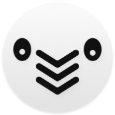

<div align="center">



# Scrollmate

**The screen-time app that gives up on you.** 🏳️

<a href="https://apps.apple.com/app/id6762578910">
  
</a>

<sub>iOS 18+ · Swift 6 · [MIT License](LICENSE)</sub>

</div>

---

## What is this

Scrollmate is an iOS app that politely checks in while you're doomscrolling, in
a slightly Australian voice, and **stops nagging if you ignore it long enough**.

Most screen-time apps yell at you, block apps, and push subscriptions.
Scrollmate doesn't. It just asks — and eventually walks away.

> *"G'day mate! Still scrolling?"*
>
> *(no answer for the 60th time)*
>
> *"...alright then. 🏳️"*

## Why it's different

| Other screen-time apps                  | Scrollmate                              |
| --------------------------------------- | --------------------------------------- |
| Block your apps                         | Doesn't block anything                  |
| Guilt-trip you                          | Asks once, then drops it                |
| Demand a subscription                   | Free; optional tip jar (5 cosmetic tiers) |
| Require an account                      | No account, no login, ever              |
| Ship analytics SDKs                     | Zero third-party SDKs, zero tracking    |
| One toggle in one place                 | Toggle from app, widget, Control Center, or lock screen — all stay in sync |

## How to use it

1. Tap **Let's Scroll** in the app, on the home widget, in Control Center, or on the lock screen.
2. Pick a reminder interval (1–60 minutes).
3. Open Instagram. Or X. Or whatever. Scrollmate will check in occasionally.
4. Reply **Yes** if you're still going. Tap **Stop scrolling** when you're done.
5. Ignore enough reminders in a row and Scrollmate quietly stops on its own.

When the session ends, you see how long you scrolled. That's it.

## Languages

Available in 8 languages out of the box:

🇺🇸 English &nbsp;·&nbsp; 🇰🇷 한국어 &nbsp;·&nbsp; 🇪🇸 Español &nbsp;·&nbsp; 🇯🇵 日本語 &nbsp;·&nbsp; 🇫🇷 Français &nbsp;·&nbsp; 🇩🇪 Deutsch &nbsp;·&nbsp; 🇷🇺 Русский &nbsp;·&nbsp; 🇨🇳 简体中文

The brand voice (`G'day mate!`, `Let's Scroll`) stays English everywhere — it's
the character, not just a string.

## Tech stack

- **Swift 6** with strict concurrency (`MainActor`-default isolation, `nonisolated` opt-outs)
- **SwiftUI** for the entire UI
- **WidgetKit + AppIntents** for the home and lock screen widgets
- **ControlWidget** (iOS 18) for the Control Center toggle
- **UserNotifications** with action categories (`Yes` / `Stop`)
- **StoreKit 2** for the non-consumable tip jar
- **App Group + UserDefaults** as the cross-process source of truth
- **Darwin notifications** (`CFNotificationCenter`) for cross-process state signaling
- **Zero third-party dependencies**

## Architecture: how the four toggle surfaces stay in sync

Four entry points (app, home widget, Control Center, lock screen widget) live
in two processes — the main app and the widget extension. Keeping them in sync
without any backend takes three pieces:

```
┌─────────────────────┐         ┌──────────────────────────┐
│  Main app process   │         │  Widget extension proc.  │
│                     │         │                          │
│  - SettingsViewMdl  │         │  - ToggleTimerIntent     │
│  - NotificationMgr  │         │  - ToggleScrollmateIntent│
│  - ScrollTabView    │         │  - ScrollmateControl     │
└──────────┬──────────┘         └─────────────┬────────────┘
           │                                  │
           ▼                                  ▼
       ┌────────────────────────────────────────┐
       │  App Group UserDefaults                │
       │  (single source of truth: activeTimers)│
       └────────────────────────────────────────┘
                         ▲
                         │ Darwin notification
                         │ "com.scrollmate.stateChanged"
                         │ (signal only — no payload)
```

1. **UserDefaults in an App Group** is the only source of truth. Whoever toggles
   the timer writes there.
2. **`WidgetCenter.reloadAllTimelines()` + `ControlCenter.reloadAllControls()`**
   tell the system "go re-query my providers." A 200ms delay before reloading
   gives UserDefaults time to flush across processes — this is the difference
   between a snappy toggle and a stale Control Center.
3. **Darwin notifications** wake the main app's observer when the widget
   process changes state, so the in-app UI re-syncs even before the next
   `scenePhase` transition.

The notification action handler defers its `completionHandler` until cleanup
finishes, so iOS doesn't suspend the background-launched app mid-task and leave
widgets stale.

## Privacy

Scrollmate doesn't collect anything.

- No accounts, no login, no email
- No third-party analytics, no ad SDKs, no crash reporters
- Session history lives only on your device
- Tip purchases are processed by Apple — Scrollmate sees only the tier

[Privacy policy](privacy.html)

## Building from source

```bash
git clone https://github.com/noyhkos/scrollmate.git
cd scrollmate
open Scrollmate.xcodeproj
```

Requirements:

- Xcode 16+
- iOS 18 SDK
- An Apple Developer account if you want to run on a physical device (App Group
  capability requires a team)

Replace the development team and App Group ID in *Signing & Capabilities* with
your own.

## License

MIT — see [LICENSE](LICENSE).

You're welcome to read, fork, learn from, or build on this codebase. If you
ship something derived from it, give it a different name and icon — Scrollmate
the brand stays mine.

## Credits

Made solo by [Sokhyon Kim](mailto:skhn00j@gmail.com) in Korea, between actual
work, while trying very hard to scroll less.

If Scrollmate helps you, the [tip jar](https://apps.apple.com/app/id6762578910)
is the loveliest way to say thanks.

🏳️
